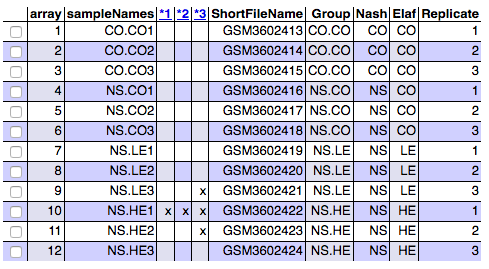
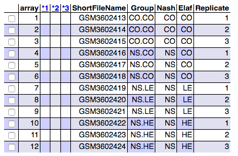

```{r setup, include=FALSE}
library(knitr)
knitr::opts_chunk$set(echo = FALSE, message = FALSE, warning = FALSE, 
                      comment = NA, prompt = TRUE, tidy = FALSE, 
                      fig.width = 6, fig.height = 6, fig_caption = TRUE,
                      cache=FALSE)
Sys.setlocale("LC_TIME", "C")
```

```{r echo=FALSE}
if(!(require(printr))) {
  install.packages(
    'printr',
    type = 'source',
    repos = c('http://yihui.name/xran', 'http://cran.rstudio.com')
  )
}
```

\newpage
# Abstract

Les dades de l'estudi contenen les lectures transcriptómica d'un nou model in vitro de stestohepatitis no-alcoholica(NASH) i del seu posterior tractament amb elafibranor, un compost potencialment terapeutic contra el NASH.

L'estudi original es pot consultar a @Boeckmans2019.

# Objectius

L'objectiu de l'estudi és identificar, a través del transcriptoma o expressió gènica, grups de gens involucrats en la malaltia en primer lloc, i resultants dels seus tractaments amb 10 $\mu$M i 30 $\mu$M d'Elafibranor respectivament. Finalment, si es possible, localitzar pathways cel·lulars rellevants amb Gene Ontology i Kyoto Enciclopedia of Genes and Genomes.

# Materials y Métodes

L'anàlisi s'ha realitzat seguint els pasos de l'estudi d'Alex Sánchez  <https://github.com/ASPteaching/Omics_Data_Analysis-Case_Study_1-Microarrays>, modificant els pasos on s'ha considerat pertinent, i utilitzant técniques més modernes en el cas de ReactomePa, tal com s'ha sugerit al fórum de l'assignatura.

El codi R no es mostrarà en el cos del document, tot i que s'hi executen *chunks*. El codi complet es pot trobar al github <https://github.com/Turing78/ADO_PEC1.git>.

Addicionalment, i per garantir la reproduïbilitat de l'anàlisi, s'inclou també el directori *data* amb les dades de les cels del microarray i el fitxer *target.csv*.

## Materials:

### Creació de l'estructura

Per començar es crea l'estructura de directoris que contindran tots els fitxers de dades o resultats de l'estudi. Són els següents:

* **./data**: conté els fitxers .CEL dels microarrays Affymetrix i el fitxer *targets.csv*
* **./figures**: gràfics que es generin durant l'estudi
* **./results**: outputs obtinguts dels diferents passos del pipeline

```{r CreateFolders, echo = FALSE, warning=FALSE}
setwd(".")
if (params$instalar) {
  dir.create("data")
  dir.create("results")
  dir.create("figures")
}
```

### Software

S'han instal·lat els paquets per a l'anàlisi de microarrays. A destacar, el paquet bioconductor d'anotacions del genoma humà del tipus de microarray Affymetrix de l'estudi (veure [Les dades per l'anàlisi]): *hgu133plus2.db*. La correspondència es pot trobar a la pàgina de Bioconductor <https://www.bioconductor.org/packages/release/data/annotation/>

```{r installPackages, echo = FALSE, message=FALSE, warning=FALSE}
if (params$instalar) 
{
  if (!require("knitr"))               install.packages("knitr")
  if (!require("colorspace"))          install.packages("colorspace")
  if (!require("gplots"))              install.packages("gplots")
  if (!require("ggplot2"))             install.packages("ggplot2")
  if (!require("ggrepel"))             install.packages("ggrepel")
  if (!requireNamespace("BiocManager", quietly = TRUE))      install.packages("BiocManager")
  BiocManager::install("oligo")
  BiocManager::install("hgu133plus2.db")
  BiocManager::install("arrayQualityMetrics")
  BiocManager::install("pvca")
  # NOT NEEDED UNTIL ANALYSES ARE PERFORMED
  BiocManager::install("limma")
  BiocManager::install("multtest")
  BiocManager::install("genefilter")
  BiocManager::install("annotate")
  BiocManager::install("clusterProfiler")
  BiocManager::install("enrichplot")
}
```

### Obtenint les dades

Les dades de l'estudi es troben a <https://www.ncbi.nlm.nih.gov/geo/query/acc.cgi?acc=GSE126484)>.
He descarregat el fitxer *GSE126484_RAW.tar* fent servir la funció *getGEOSuppFiles* del paquet *GEOquery*. Després l'he descomprimit i he obtingut els fitxers .CEL.gz, que un cop descomprimits he mogut a la carpeta data. També es podrien haver llegit les dades directament en un expression Set utilitzant la funció *getGEO*, però en cas d'haver de fer diverses iteracions és preferible només haver de llegir les dades cada cop que s'executa el pipeline. 

```{r GetData, echo = FALSE, message=FALSE, warning=FALSE, eval=FALSE}
library(GEOquery)
if(!file.exists(paste0("./data/GSE126484")))
  getGEOSuppFiles("GSE126484", baseDir="data")
```

### Les dades per l'anàlisi

Les dades consten de 12 fitxers. El tres primers contenen cadascun l'mRNA total de les mostres de control, que són en aquest cas cél·lules mare derivades de pell humana i diferenciades cap a cel·lules hepàtiques (hSKP-HPC). Els tres següents s'obtenen d'exposar aquestes mostres durant 24 hores a agents causants del NASH. Els 6 últims són el tractament d'aquestes mostres amb elafibranor a 10 $\mu$M i 30 $\mu$M. 

La tecnologia és *Affymetrix Human Genome U133 Plus 2.0 Array*, arrays d'olinucleòtids, que ofereixen una cobertura completa del genoma representats en *GeneChip Human Genome U133 Set*: [HG-U113_Plus_2](https://www.ncbi.nlm.nih.gov/geo/query/acc.cgi?acc=GPL570).

Es construeix el fitxer de *targets* següent a partir del nom dels fitxers (o utilitzant les dades proporcionades a l'asccession): 

```{r ReadTargets, echo = FALSE}
targets <- read.csv2("./data/targets.csv", header = TRUE, sep = ";")
# Trec els noms dels fitxers que són molt llargs
targets <- targets[-1]
knitr::kable(
  targets, booktabs = TRUE,
  caption = 'Content of the targets file used for the current analysis')
```

Els camps són:

* **Filename**: nom del fitxer (no apareix a taula per ser massa llarg)
* **ShortFilename**: nom dels fitxers .CEL
* **Group**: resum de les condicions de l'experiment 
* **Nash**: grup de control o malalt
* **Elaf**: Nivell d'Elafibranor
* **Replicate**: Número assignat a cada mostra
* **ShortName**: nom curt per cadascuna de les cel·les del microarray.

Es consideren dos factors pel que fa al disseny de l'experiment:Nash i Elaf. Nash té dos nivells: *CO* (control) i *NS* (per les cél·lules in vitro sobre les que s'ha causat la malaltia). Elaf té 3 nivells: *CO* (control), *LE* ("low elaf") per les mostres a 10 $\mu$M i *HE* ("high elaf) per les mostres a 30 $\mu$M.

\newpage
## Métodes

###  Llegint els fitxers CEL

Llegim les dades dels fitxers .CEL guardats a data fent servir la llibreria *oligo*, creant una estructura "crua" (*raw*) de les dades. En aquesta estructura també es guarden les dades del fitxer *targets.csv* com a *phenoData*.

```{r ReadCELfiles, echo = FALSE, message=FALSE, results='hide', warning=FALSE}
library(oligo)
celFiles <- list.celfiles("./data", full.names = TRUE)
celFiles
library(Biobase)
my.targets <-read.AnnotatedDataFrame(file.path("./data","targets.csv"), 
                                     header = TRUE, row.names = 1, 
                                     sep=";") 
rawData <- read.celfiles(celFiles, phenoData = my.targets)
```

Es canvia el nom llarg de les mostres per la columna *ShortName* del fitxer *targets.csv*, més comprensible.

```{r ChangeName, echo = FALSE}
my.targets@data$ShortName->rownames(pData(rawData))
colnames(rawData) <-rownames(pData(rawData)) 
```

### Control de qualitat de les dades raw

Abans de la normalització de les dades, és important realitzar-ne el control de qualitat. Per això s'utilitza la llibreria *arrayQualityMetrics*. Els resultats es guarden al directori *results/QCDir.Raw* en forma d'html, es poden consultar obrint el fitxer *index.htlm* amb un navegador. En el següent gráfic veiem els outliers, que es marquen si un microarray es troba per sobre d'un determinat nivell en un dels anàlisis de qualitat realitzats. Tres marques indiquen que s'hauria de revisar amb cura, i possiblement descartar per millorar la qualitat de l'experiment.

```{r QCRaw, echo = FALSE, message=FALSE, warning=FALSE}
if (params$grafics)
  library(arrayQualityMetrics)
arrayQualityMetrics(rawData,file.path("./results", "QCDir"),force = TRUE)
```

```{r QCRawRes, fig.cap="Aspect of the summary table", echo=FALSE, fig.width=4}
 
```

En aquest cas tenim dubtós el valor per *NS.HE1*. Revisem amb el gràfic de components i el boxplot d'intensitats:

```{r, echo = FALSE}
if (params$grafics) {
  library(ggplot2)
  library(ggrepel)
  plotPCA3 <- function (datos, labels, factor, title, scale,colores, size = 1.5, glineas = 0.25) {
    data <- prcomp(t(datos),scale=scale)
    # plot adjustments
    dataDf <- data.frame(data$x)
    Group <- factor
    loads <- round(data$sdev^2/sum(data$sdev^2)*100,1)
    # main plot
    p1 <- ggplot(dataDf,aes(x=PC1, y=PC2)) +
      theme_classic() +
      geom_hline(yintercept = 0, color = "gray70") +
      geom_vline(xintercept = 0, color = "gray70") +
      geom_point(aes(color = Group), alpha = 0.55, size = 3) +
      coord_cartesian(xlim = c(min(data$x[,1])-5,max(data$x[,1])+5)) +
      scale_fill_discrete(name = "Group")
    # avoiding labels superposition
    p1 + geom_text_repel(aes(y = PC2 + 0.25, label = labels),segment.size = 0.25, size = size) + 
      labs(x = c(paste("PC1",loads[1],"%")),y=c(paste("PC2",loads[2],"%"))) +  
      ggtitle(paste("Principal Component Analysis for: ",title,sep=" "))+ 
      theme(plot.title = element_text(hjust = 0.5)) +
      scale_color_manual(values=colores)
  }
}
```

\newpage

El primer component del PCA explica el 64.2% de la variabilitat total de les mostres. Coincideix amb la condició d'outlier de la primera mostra de Elafibranor a 30 $\mu$M, que es veu més a la dreta.

```{r PCARaw, echo = FALSE, message=FALSE, fig.cap="Visualization of the two first Principal Components for raw data"}
if (params$grafics) {
  plotPCA3(exprs(rawData), labels = targets$ShortName, factor = targets$Group, 
         title="Raw data", scale = FALSE, size = 3, 
         colores = c("red", "blue", "green", "yellow"))
}
```

```{r savePCAraw, echo=FALSE, results='hide'}
if (params$grafics) {
tiff("figures/PCA_RawData.tiff", res = 200, width = 4.5, height = 4, units = 'in')
plotPCA3(exprs(rawData), labels = targets$ShortName, factor = targets$Group, 
         title="Raw data", scale = FALSE, size = 2, 
         colores = c("red", "blue", "green", "yellow"))
dev.off()
}
```

\newpage

```{r BoxplotRaw, echo = FALSE, message=FALSE, fig.cap="Boxplot for arrays intensities (Raw Data)"}
if (params$grafics) {
boxplot(rawData, cex.axis=0.5, las=2,  which="all", 
         col = c(rep("red", 3), rep("blue", 3), rep("yellow", 3), rep("green", 3)),
         main="Distribution of raw intensity values")
}
```

```{r saveIntensRaw, echo=FALSE, results='hide'}
if (params$grafics) {
tiff("figures/Intensity_RawData.tiff", res = 200, width = 4, height = 4, units = 'in')
boxplot(rawData, cex.axis=0.5, las=2,  which="all", 
         col = c(rep("red", 3), rep("blue", 3), rep("green", 3), rep("yellow", 3)),
         main="Distribution of raw intensity values")
dev.off()
}
```

El boxplot confirma la desalineació del primer microarray amb elafibranor. Si no millora amb la normalització serà descartat de l'experiment.


### Normalització de les dades

Per realitzar l'estudi de gens diferencialment expressats es necessari normalitzar les dades crues préviament per fer-les comparables. S'utilitza el mètode *rma* (Robust Multichip Analysis), que és el més freqüentment utilitzat per a les microarrays d'Affimetrix, tot i que existeixen altres mètodes de normalització. El programa ens indica els tres passos que segueix:

```{r Normalization, echo = FALSE, message=FALSE}
eset_rma <- rma(rawData)
```

1- Correcció de soroll de fons, 2- Normalizació per fer comparables els arrays i 3-Combinar les intensitats de les sondes entre els diferents arrays, perquè la mesura final representi fidelment el nivell l'expressió dels gens.

### Control de qualitat de les dades normalitzades

Repetim el control de qualitat amb les noves dades normalitzades. Els resultats es guarden al directori *results/QCDir.Norm*. Revisem si els valors dels outliers han millorat amb la normalització.

```{r QCNorm, echo = FALSE, message=FALSE, warning=FALSE}
if (params$grafics) {
arrayQualityMetrics(eset_rma, outdir = file.path("./results", "QCDir.Norm"), force=TRUE)
}  
```

El resum es pot veure a la següent figura:

```{r QCNormRes, fig.cap="Aspect of the summary table", echo=FALSE, fig.width=4}

```

\newpage

Es pot comprovar que tots els outliers han desaparegut. Revisem els gràfics PCA i el boxplot d'intensitats.

```{r PCANorm, echo = FALSE, message=FALSE, fig.cap="Visualization of first two principal components for normalized data"}
if (params$grafics) {
plotPCA3(exprs(eset_rma), labels = targets$ShortName, factor = targets$Group, 
         title="Normalized data", scale = FALSE, size = 3, 
         colores = c("red", "blue", "green", "yellow"))
}
```

```{r savePCAnorm, echo=FALSE, results='hide'}
if (params$grafics) {
tiff("figures/PCA_NormData.tiff", res = 150, width = 5, height = 5, units = 'in')
plotPCA3(exprs(eset_rma), labels = targets$ShortName, factor = targets$Group, 
         title="Normalized data", scale = FALSE, size = 2, 
         colores = c("red", "blue", "green", "yellow"))
dev.off()
}
```

Els grups apareixen ara més compactes i separats.

\newpage

Els boxplots són pràcticament idéntics.

```{r BoxplotNorm, echo = FALSE, message=FALSE, fig.cap="Distribution of  intensities for normalized data"}
if (params$grafics) {
boxplot(eset_rma, cex.axis=0.5, las=2, 
         col = c(rep("red", 3), rep("blue", 3), rep("green", 3), rep("yellow", 3)),
         main="Boxplot for arrays intensity: Normalized Data")
}
```

```{r saveIntensNorm, echo=FALSE, results='hide'}
if (params$tiff) {
tiff("figures/Intensity_NormData.tiff", res = 150, width = 5, height = 5, units = 'in')
boxplot(eset_rma, cex.axis=0.5, las=2,  which="all", 
         col = c(rep("red", 3), rep("blue", 3), rep("green", 3), rep("yellow", 3)),
         main="Boxplot for arrays intensity: Normalized Data")
dev.off()
}
```

\newpage
### Detecció de l'efecte "batch"

Les dates que apareixen a *protocolData* indiquen que les microarrays de les mostres amb elafibranor es van realitzar 5 mesos més tard que les de control i NASH, i les de control i NASH es van fer amb una hora de diferència. 

Per tant comprovem si es dóna aquest efecte amb un gràfic de barres:

```{r BatchDetection, echo = FALSE, message=FALSE, warning=FALSE}
if (params$grafics) {
  
protocolData(rawData)$dates
#load the library
library(pvca)
pData(eset_rma) <- targets
#select the threshold
pct_threshold <- 0.6
#select the factors to analyze
batch.factors <- c("Nash", "Elaf")
#run the analysis
pvcaObj <- pvcaBatchAssess (eset_rma, batch.factors, pct_threshold)
}
```

```{r plotPVCA, echo = FALSE, fig.cap="Relative importance of the different factors -NASH, elafibranor and interaction- affecting gene expression"}
if (params$grafics) {
#plot the results
bp <- barplot(pvcaObj$dat, xlab = "Effects",
  ylab = "Weighted average proportion variance",
  ylim= c(0,1.1),col = c("mediumorchid"), las=2,
  main="PVCA estimation")
axis(1, at = bp, labels = pvcaObj$label, cex.axis = 0.55, las=2)
values = pvcaObj$dat
new_values = round(values , 3)
text(bp,pvcaObj$dat,labels = new_values, pos=3, cex = 0.5)
}
```

```{r savePVCAplot, echo=FALSE, results='hide'}
if (params$tiff) {
tiff("figures/PVCAplot.tiff", res = 150, width = 5, height = 5, units = 'in')
bp <- barplot(pvcaObj$dat, xlab = "Effects",
  ylab = "Weighted average proportion variance",
  ylim= c(0,1.1),col = c("mediumorchid"), las=2,
  main="PVCA estimation")
axis(1, at = bp, labels = pvcaObj$label, cex.axis = 0.45, las=2)
values = pvcaObj$dat
new_values = round(values , 3)
text(bp,pvcaObj$dat,labels = new_values, pos=3, cex = 0.5)
dev.off()
}
```

La major variació es produeix al factor Nash amb un 54.4 %.

\newpage
### Detectant els gens més variables

El gràfic següent ens mostra les desviacions estàndard de tots els gens ordenada de menor a major. Els gens més variables seràn els que tenen una desviació estàndard per sobre del 90-95% de totes les desviacions estàndard. 

```{r SDplot, echo = FALSE, fig.cap="Values of standard deviations along all samples for all genes ordered from smallest to biggest"}
if (params$grafics) {
sds <- apply (exprs(eset_rma), 1, sd)
sdsO<- sort(sds)
plot(1:length(sdsO), sdsO, main="Distribution of variability for all genes",
     sub="Vertical lines represent 90% and 95% percentiles",
     xlab="Gene index (from least to most variable)", ylab="Standard deviation")
abline(v=length(sds)*c(0.9,0.95))
}
```


```{r SDplotTiff, echo = FALSE, fig.cap="Values of standard deviations along all samples for all genes ordered from smallest to biggest"}
if (params$tiff)
{
tiff("figures/SDplot.tiff", res = 150, width = 5, height = 5, units = 'in')
plot(1:length(sdsO), sdsO, main="Distribution of variability for all genes",
     sub="Vertical lines represent 90% and 95% percentiles",
     xlab="Gene index (from least to most variable)", ylab="Standard deviation")
abline(v=length(sds)*c(0.9,0.95))
dev.off()
}
```

\newpage
### Filtrant els gens menys variables

Per escollir el punt de tall fem servir el paquet *multtest* que ens permet calcular el punt de tall per filtrar els gens. Com que l'objectiu d'aquest experiment és la captura de gens és raonable permetre alguns falsos positius i decidir controlar l'FDR (false discovery rates) que és menys restrictiu que l'FWER. 

```{r multtest, echo=FALSE}
library(multtest)
library(genefilter)
procs <- c("Bonferroni","BH", "BY")
teststat <-rowttests(eset_rma, "Nash")
ranked <-teststat[order(teststat$p.value),]
adjPvalues <- mt.rawp2adjp(teststat$p.value, procs)
names(adjPvalues)
ranked.adjusted<-cbind(ranked, adjPvalues$adjp)
head(format(ranked.adjusted,digits=4))
```

Aquest és el número de gens si tallessin per FWER amb un valor de Bonferroni ajustat de menys de 0.0001:

```{r FWER, echo=FALSE}
selectedAdjusted<-ranked.adjusted[ranked.adjusted$Bonferroni<0.0001,]
nrow(selectedAdjusted)
```

Aquest és el número de gens que tallarem segonsBenjamin & Hochberg amb un valor ajustat de menys de 0.0001:

```{r FDR, echo=FALSE}
selectedAdjusted<-ranked.adjusted[ranked.adjusted$BH<0.0001,]
nrow(selectedAdjusted)
```

Tenint en aquest càlcul apliquem el valor *var.cutoff=0.7* a les dades normalitzades per filtrar (amb la funció *nsFilter* de *genefilter*) els gens amb la desviació estàndard més alta, eliminant aquells que puguin tenir una desviació deguda a l'atzar. L'anotació que es fa servir és el paquet *hgu133plus2.db* ja mencionat.

```{r Filtering1, echo = FALSE, results='hide', message=FALSE}
featureData(eset_rma)
library(hgu133plus2.db)
annotation(eset_rma)<- "hgu133plus2.db"
filtered <- nsFilter(eset_rma, 
                     require.entrez = TRUE, remove.dupEntrez = TRUE,
                     var.filter=TRUE, var.func=IQR, var.cutoff=0.70, 
                     filterByQuantile=TRUE, feature.exclude = "^AFFX")
show(eset_rma)
```

```{r FilterResults2, echo = FALSE}
print(filtered$filter.log)
eset_filtered <-filtered$eset
```

Desprès de filtrar queden `r dim(exprs(eset_filtered))[1]` gens. Aquests estaràn guardats a la variable *eset_filtered*

### Gravació de les dades filtrades i normalitzades

Es graven els resultats en el directori *./results* per utilitzar en anàlisis posteriors. Els fitxers són:

* **normalized.Data.csv**: Dades normalitzades
* **normalized.Filtered.Data.csv**: Dades filtrades
* **normalized.Filtered.Data.Rda**: Dades normalitzades i filtrades

```{r SaveData1, echo = FALSE, results='hide', message=FALSE}
write.csv(exprs(eset_rma), file="./results/normalized.Data.csv")
write.csv(exprs(eset_filtered), file="./results/normalized.Filtered.Data.csv")
save(eset_rma, eset_filtered, file="./results/normalized.Data.Rda")
```

\newpage
### La matriu de disseny

S'utilitza el mètode de models lineals per a microarrays, implementat al paquet *limma*, sobre *eset_filtered* per a seleccionar gens diferencialment expressats. El primer pas és calcular la matriu de disseny.

```{r LoadSavedData, echo = FALSE}
if (!exists("eset_filtered")) load (file="./results/normalized.Data.Rda")
```

```{r DesignMatrix, echo = FALSE, message=FALSE}
library(limma)
library(Biobase)
designMat<- model.matrix(~0+Group, pData(eset_filtered))
colnames(designMat) <- c("CO.CO", "NS.CO","NS.HE","NS.LE")
print(designMat)
```

\newpage
### Definint comparacions amb la matriu de contrastos

Es defineixen 6 comparacions. De cadascuna obtindrem els gens diferencialment expressats ordenats pel p-valor, de més petit a més gran.

```{r setContrasts, echo = FALSE}
cont.matrix <- makeContrasts (NSvsCO = NS.CO - CO.CO,
                              LEvsCO = NS.LE - CO.CO,
                              HEvsCO = NS.HE - CO.CO,
                              LEvsNS = NS.LE - NS.CO,
                              HEvsNS = NS.HE - NS.CO,
                              HEvsLE = NS.HE - NS.LE,
                              levels=designMat)
print(cont.matrix)
```

```{r linearmodelfit, echo = FALSE,message=FALSE}
library(limma)
fit<-lmFit(eset_filtered, designMat)
fit.main<-contrasts.fit(fit, cont.matrix)
fit.main<-eBayes(fit.main)
class(fit.main)
```


### Llista de gens diferencialment expressats

Per a la comparació 1 (NSvsCO): Gens que han canviat l'expressió després de causar la malaltia NASH al grup de control.

```{r topTabs1, echo = FALSE}
topTab_NSvsCO <- topTable (fit.main, number=nrow(fit.main), coef="NSvsCO", adjust="fdr")
knitr::kable(
  head(format(topTab_NSvsCO, digits = 4)), booktabs = TRUE,
  caption = 'First 5 records of the table topTab_NSvsCO')
```

```{r topTabs2, echo = FALSE}
#Per a la comparació 2 (LEvsCO): Gens de les mostres NASH line que han canviat la seva expressió després de 10 $\mu$M Elafibranor.
topTab_LEvsCO <- topTable (fit.main, number=nrow(fit.main),coef="LEvsCO", adjust="fdr") 
#head(topTab_LEvsCO)
```

```{r topTabs3, echo = FALSE}
#Per a la comparació 3 (HEvsNS): Gens de les mostres NASH line que han canviat la seva expressió després de 30 $\mu$M Elafibranor.
topTab_HEvsCO <- topTable (fit.main, number=nrow(fit.main), coef="HEvsCO", adjust="fdr")
#head(topTab_HEvsCO)
```

Per a la comparació 4 (LEvsNS): Gens que han canviat la seva expressió desde la malaltia NASH després de 10 $\mu$M d'Elafibranor.

```{r topTabs4, echo = FALSE}
topTab_LEvsNS <-  topTable (fit.main, number=nrow(fit.main), coef="LEvsNS", adjust="fdr") 
knitr::kable(
  head(format(topTab_LEvsNS, digits = 4)), booktabs = TRUE,
  caption = 'First 5 records of the table topTab_LEvsNS')
```

Per a la comparació 5 (HEvsNS): Gens que han canviat la seva expressió desde la malaltia NASH després de 30 $\mu$M d'Elafibranor.

```{r topTabs5, echo = FALSE}
topTab_HEvsNS <- topTable (fit.main, number=nrow(fit.main), coef="HEvsNS", adjust="fdr") 
knitr::kable(
  head(format(topTab_HEvsNS, digits = 4)), booktabs = TRUE,
  caption = 'First 5 records of the table topTab_HEvsNS')
```

Per a la comparació 6 (HEvsLE): Comparació dels dos tractaments amb Elafibranor desde NASH.

```{r topTabs6, echo = FALSE}
topTab_HEvsLE <- topTable (fit.main, number=nrow(fit.main), coef="HEvsLE", adjust="fdr") 
knitr::kable(
  head(format(topTab_HEvsLE, digits = 4)), booktabs = TRUE,
  caption = 'First 5 records of the table topTab_HEvsLE')
```

Nota: no s'inclouen les comparacions 2 i 3 perquè les taules són pràcticament idéntiques a les obtingudes a la comparació 1. Només disminueixen unes décimes a logFC. Aquestes dades es poden consultar als fitxers de la carpeta resultats.

### Anotació de gens

El procés d'anotació fa servir els identificadors de les taules obtingudes per obtenir informació addicional(simbol del gen, Entrez id o descripció del gen). En la taula següent es poden veure les 4 primeres columnes i 5 primeres files de la comparació 1 anotada.

```{r GeneAnnotation, echo = FALSE, message=FALSE, warning=FALSE}
annotatedTopTable <- function(topTab, anotPackage)
{
  topTab <- cbind(PROBEID=rownames(topTab), topTab)
  myProbes <- rownames(topTab)
  thePackage <- eval(parse(text = anotPackage))
  geneAnots <- select(thePackage, myProbes, c("SYMBOL", "ENTREZID", "GENENAME"))
  annotatedTopTab<- merge(x=geneAnots, y=topTab, by.x="PROBEID", by.y="PROBEID")
return(annotatedTopTab)
}
```

```{r annotateTopTables, echo = FALSE}
library(annotate)
topAnnotated_NSvsCO <- annotatedTopTable(topTab_NSvsCO,
anotPackage="hgu133plus2.db")
topAnnotated_LEvsCO <- annotatedTopTable(topTab_LEvsCO,
anotPackage="hgu133plus2.db")
topAnnotated_HEvsCO <- annotatedTopTable(topTab_HEvsCO,
anotPackage="hgu133plus2.db")
topAnnotated_LEvsNS <- annotatedTopTable(topTab_LEvsNS,
anotPackage="hgu133plus2.db")
topAnnotated_HEvsNS <- annotatedTopTable(topTab_HEvsNS,
anotPackage="hgu133plus2.db")
topAnnotated_HEvsLE <- annotatedTopTable(topTab_HEvsLE,
anotPackage="hgu133plus2.db")
write.csv(topAnnotated_NSvsCO, file="./results/topAnnotated_NSvsCO.csv")
write.csv(topAnnotated_LEvsNS, file="./results/topAnnotated_LEvsCO.csv")
write.csv(topAnnotated_HEvsNS, file="./results/topAnnotated_HEvsCO.csv")
write.csv(topAnnotated_LEvsNS, file="./results/topAnnotated_LEvsNS.csv")
write.csv(topAnnotated_HEvsNS, file="./results/topAnnotated_HEvsNS.csv")
write.csv(topAnnotated_HEvsLE, file="./results/topAnnotated_HEvsLE.csv")
```

```{r annotatedTop, echo=FALSE}
short<- head(topAnnotated_NSvsCO[1:5,1:4])
knitr::kable(
  short, booktabs = TRUE,
  caption = 'Annotations for the comparison "NSvsCO"'
)
```

\newpage
### Visualitzant l'expressió diferencial

S'usen volcano-plots per a una visualització en global. A tall d'exemple, es mostra el volcano-plot del contrast NSvsCO. Per obtenir els simbols es torna a fer servir la base de dades *hgu133plus2.db*.


```{r volcanoPlot, echo=FALSE, fig.cap="Volcano plot for the comparison between NASH and high dose of elafibranor. The names of the top 4 genes (i.e. the first four genes in the topTable) are shown in the plot"}
if (params$grafics) {
geneSymbols <- select(hgu133plus2.db, rownames(fit.main), c("SYMBOL"))
SYMBOLS<- geneSymbols$SYMBOL
volcanoplot(fit.main, coef=1, highlight=4, names=SYMBOLS, 
            main=paste("Differentially expressed genes", colnames(cont.matrix)[5], sep="\n"))
  abline(v=c(-1,1))
}
```

```{r saveVolcanos, echo=FALSE, results='hide'}
if (params$tiff) {
tiff("figures/VolcanoPlot.tiff", res = 150, width = 5, height = 5, units = 'in')
volcanoplot(fit.main, coef=1, highlight=4, names=SYMBOLS, 
            main=paste("Differentially expressed genes", colnames(cont.matrix)[5], sep="\n")) 
abline(v=c(-1,1))

dev.off()

pdf("figures/Volcanos.pdf")
for (i in colnames(cont.matrix)){
  volcanoplot(fit.main, coef=i, highlight=4, names=SYMBOLS,
              main=paste("Differentially expressed genes",i, sep="\n"))
  abline(v=c(-1,1))
}
dev.off()
}
```

### Comparacions múltiples

En aquest cas com que tenim diversos contrastos és interessant saber si hi ha gens que han estat seleccionats en més d'un contrast, en un d'ells però no en d'altres, etc. Les funcions *decideTests* i *VennDiagram* de *limma* es poden utilitzar per comptar i anotar els gens de cada comparació i representar-los en un diagrama de Venn.

```{r decideTests.1, echo = FALSE}
library(limma)
res<-decideTests(fit.main, method="separate", adjust.method="fdr", p.value=0.1, lfc=1)
```

```{r resumeDecideTests, echo = FALSE}
sum.res.rows<-apply(abs(res),1,sum)
res.selected<-res[sum.res.rows!=0,] 
print(summary(res))
```


```{r vennDiagram, echo = FALSE, fig.cap="Venn diagram showing the genes in common between the three comparisons performed"}
if (params$grafics) {
vennDiagram (res.selected[,1:3], cex=0.9)
title("Genes in common between the first three comparisons\n Genes selected with FDR < 0.1 and logFC > 1")
}
```

```{r vennPlot, echo=FALSE, results='hide'}
if (params$tiff) {
tiff("figures/VennPlot.tiff", res = 150, width = 5.5, height = 5.5, units = 'in')
vennDiagram (res.selected[,1:3], cex=0.9)
title("Genes in common between the first three comparisons\n Genes selected with FDR < 0.1 and logFC > 1")
dev.off()
}
```

\newpage
### Heatmaps

Una altra bona manera de visualitzar els gens diferentment expressats és l'ús de *heatmaps*. En aquests gràfics es fan servir colors per ressaltar nivells d'expressió diferents.

```{r data4Heatmap, echo = FALSE}
if (params$grafics) {
probesInHeatmap <- rownames(res.selected)
HMdata <- exprs(eset_filtered)[rownames(exprs(eset_filtered)) %in% probesInHeatmap,]

geneSymbols <- select(hgu133plus2.db, rownames(HMdata), c("SYMBOL"))
SYMBOLS<- geneSymbols$SYMBOL
rownames(HMdata) <- SYMBOLS
write.csv(HMdata, file = file.path("./results/data4Heatmap.csv"))
}
```

```{r heatmapNoclustering, echo = FALSE, fig.width=6, fig.cap="Heatmap for expression data without any grouping"}
if (params$grafics) {
my_palette <- colorRampPalette(c("blue", "red"))(n = 299)
library(gplots)

heatmap.2(HMdata,
          Rowv = TRUE,
          Colv = TRUE,
          main = "Differentially expressed genes \n FDR < 0,1, logFC >=1",
          scale = "row",
          col = my_palette,
          sepcolor = "white",
          sepwidth = c(0.05,0.05),
          cexRow = 0.5,
          cexCol = 0.9,
          key = TRUE,
          keysize = 1.5,
          density.info = "histogram",
          ColSideColors = c(rep("red",3),rep("blue",3), rep("green",3),rep("yellow",3)),
          tracecol = NULL,
          dendrogram = "both",
          srtCol = 30)
}
```


```{r, echo=FALSE,  results='hide'}
if (params$tiff) {
tiff("figures/Heatmap1.tiff", res = 150, width = 5.5, height = 5.5, units = 'in')
heatmap.2(HMdata,
          Rowv = TRUE,
          Colv = TRUE,
          main = "Differentially expressed genes \n FDR < 0,1, logFC >=1",
          scale = "row",
          col = my_palette,
          sepcolor = "white",
          sepwidth = c(0.05,0.05),
          cexRow = 0.5,
          cexCol = 0.9,
          key = TRUE,
          keysize = 1.5,
          density.info = "histogram",
          ColSideColors = c(rep("red",3),rep("blue",3), rep("green",3),rep("yellow",3)),
          tracecol = NULL,
          dendrogram = "both",
          srtCol = 30)
dev.off()

tiff("figures/Heatmap2.tiff", res = 150, width = 5.5, height = 5.5, units = 'in')
heatmap.2(HMdata,
          Rowv = FALSE,
          Colv = FALSE,
          dendrogram = "none",
          main = "Differentially expressed genes \n FDR < 0,1, logFC >=1",
          scale = "row",
          col = my_palette,
          sepcolor = "white",
          sepwidth = c(0.05,0.05),
          cexRow = 0.5,
          cexCol = 0.9,
          key = TRUE,
          keysize = 1.5,
          density.info = "histogram",
          ColSideColors = c(rep("red",3),rep("blue",3), rep("green",3),rep("yellow",3)),
          tracecol = NULL,
          srtCol = 30)
dev.off()
}
```

### Significació biológica

Interpretar els resultats obtinguts comporta anàlitzar la llista de gens obtinguda i veure quines funcions, processos biològics o pathways de molècules apareixen amb major freqüencia en aquesta llista de gens. Al filtrar els gens és recomanable que la selecció sigui menys restrictiva que la realitzada anteriorment. Treballarem amb el paquet *ClusterProfile* seguint les instruccions que es troben a @Yu2020.

Primer cal preparar un vector de gens per a cada comparació triada amb el valor `fold change` ordenat de major a menor i l'EntrezID com a nom de cada fila. Es mostra el número de gens filtrats en cada cas:

```{r prepare4ClusterProfile, echo=FALSE}
listOfTables <- list(NSvsCO  = topTab_NSvsCO, 
                     LEvsNS  = topTab_LEvsNS,
                     HEvsNS  = topTab_HEvsNS)
listOfSelected <- list()
for (i in 1:length(listOfTables)){
  # select the toptable
  topTab <- listOfTables[[i]]
  # select the genes to be included in the analysis
  whichGenes<-topTab["adj.P.Val"]<0.15
 # whichGenes<-abs(topTab["logFC"])>1
  selectedIDs <- rownames(topTab)[whichGenes]
  # convert the ID to Entrez
  EntrezIDs<- select(hgu133plus2.db, selectedIDs, c("ENTREZID"))
  # Disregard the probeID
  EntrezIDs <- EntrezIDs$ENTREZID
  listOfSelected[[i]] <- topTab$logFC[whichGenes]
  names(listOfSelected[[i]])<-EntrezIDs
  listOfSelected[[i]] <- sort(listOfSelected[[i]], decreasing = TRUE)
  names(listOfSelected)[i] <- names(listOfTables)[i]
}
sapply(listOfSelected, length)
```

Hi ha funcions separades per Gene Onthology i KEGG (pathway), *enrichGO* i *enrichKEGG*. Per a cadascuna guardem:

* Un fitxer *csv* amb un resum de tots els pathways obtinguts i les seves estadístiques
* Un gràfic de barres amb els millors enriched pathways 
* Un gràfic amb la xarxa dels enriched pathways i la seva relació amb els gens diferentment expressats.
  

```{r clusterProfilerGO}
library(clusterProfiler)
library(enrichplot)
# browseVignettes("clusterProfiler")

comparisonsNames <- names(listOfSelected)

for (i in 1:length(listOfSelected)){
  geneList <- listOfSelected[[i]]
  comparison <- comparisonsNames[i]
  gene <- names(geneList)[abs(geneList) > 2]
  
  enrich.result <- enrichGO(gene = gene,
                universe         = names(geneList),
                OrgDb            = org.Hs.eg.db,
                ont              = "ALL",
                pAdjustMethod    = "BH",
                pvalueCutoff     = 0.05,
                qvalueCutoff     = 0.15,
                readable      = TRUE)
  
  if (length(rownames(enrich.result@result)) != 0) {
  write.csv(as.data.frame(enrich.result), 
             file =paste0("./results/","ClusterProfileGO.Results.",comparison,".csv"), 
             row.names = FALSE)
    
 pdf(file=paste0("./results/","ClusterProfileGOBarplot.",comparison,".pdf"))
    print(barplot(enrich.result, showCategory = 10, font.size = 9, 
            title = paste0("ClusterProfiler GO Pathway Analysis for ", comparison,". Barplot")))
  dev.off()    
    
   edox <- setReadable(enrich.result, 'org.Hs.eg.db', 'ENTREZID')       
  
  pdf(file = paste0("./results/","ClusterProfileGOcnetplot.",comparison,".pdf"))
    print(cnetplot(edox, showCategory = 5, foldChange=geneList ))
  dev.off()  
  }
}
```

```{r clusterProfilerKEGG}
library(clusterProfiler)
# browseVignettes("clusterProfiler")

comparisonsNames <- names(listOfSelected)

for (i in 1:length(listOfSelected)){
  geneList <- listOfSelected[[i]]
  comparison <- comparisonsNames[i]
  gene <- names(geneList)[abs(geneList) > 2]
  
  enrich.result <- enrichKEGG(gene         = gene,
                 organism     = 'hsa',
                 pvalueCutoff = 0.05)
  
  if (length(rownames(enrich.result@result)) != 0) {
  write.csv(as.data.frame(enrich.result), 
             file =paste0("./results/","ClusterProfileKEGG.Results.",comparison,".csv"), 
             row.names = FALSE)
    
   pdf(file=paste0("./results/","ClusterProfileKEGGBarplot.",comparison,".pdf"))
   print(barplot(enrich.result, showCategory = 10, font.size = 9, 
            title = paste0("ClusterProfile KEGG Pathway Analysis for ", comparison,". Barplot")))
   dev.off()  
    
   edox <- setReadable(enrich.result, 'org.Hs.eg.db', 'ENTREZID')   
  pdf(file = paste0("./results/","ClusterProfileKEGGcnetplot.",comparison,".pdf"))
    print(cnetplot(edox, showCategory = 5,foldChange=geneList ))
  dev.off()  
  }
}
```

Mostrem els gràfics de xarxa per dues de les comparacions:

```{r cnetplot1.1, echo = FALSE, fig.cap="Net diagram showing the KEGG pathways for NSvsCO"}
include_graphics("results/ClusterProfileKEGGcnetplot.NSvsCO.pdf")
```

\newpage

```{r cnetplot1.2, echo = FALSE, fig.cap="Net diagram showing the gene ontology for NSvsCO"}
include_graphics("results/ClusterProfileGOcnetplot.NSvsCO.pdf")
```

\newpage

```{r cnetplot2, echo = FALSE, fig.cap="Net diagram showing the gene ontology and KEGG for LEvsNS"}
#par(mfrow=c(1,2))
#include_graphics("results/ClusterProfileKEGGcnetplot.LEvsNS.pdf")
#include_graphics("results/ClusterProfileGOcnetplot.LEvsNS.pdf")
```

\newpage

```{r cnetplot2.1, echo = FALSE, fig.cap="Net diagram showing the enrichment analisys with KEGG pathways for HEvsNS"}
include_graphics("results/ClusterProfileKEGGcnetplot.HEvsNS.pdf")
```

\newpage

```{r cnetplot2.2, echo = FALSE, fig.cap="Net diagram showing the enrichment analisys with gene ontology for HEvsNS"}
include_graphics("results/ClusterProfileGOcnetplot.HEvsNS.pdf")
```

I les taules resultants de la primera comparació:

```{r tableCP, echo=FALSE}
Tab.react <- read.csv2(file.path("./results/ClusterProfileGO.Results.NSvsCO.csv"), 
                       sep = ",", header = TRUE)

Tab.react <- Tab.react[1:4, 1:5]
knitr::kable(Tab.react, booktabs = TRUE, caption = "First rows and columns for ClusterProfiler GO on NSvsCO comparison")

Tab.react2 <- read.csv2(file.path("./results/ClusterProfileKEGG.Results.NSvsCO.csv"), 
                       sep = ",", header = TRUE)

Tab.react2 <- Tab.react2[1:4, 1:5]
knitr::kable(Tab.react2, booktabs = TRUE, caption = "First rows and columns for ClusterProfiler KEGG on NSvsCO comparison")
```

# Resultats

Un cop completat el pipeline s'han obtingut una llista de fitxers i de gràfics amb les dades dels resultats obtinguts. Aquests són la base per interpretar i discutir la significació biològica de l'experiment. Aquesta és la taula resum amb tots els fitxers que s'han generat.

```{r listOfFiles, echo=FALSE}
listOfFiles <- read.csv2(file.path("./results/List_of_files.csv")                         , sep = ",", header = TRUE)
knitr::kable(
  listOfFiles, booktabs = TRUE,
  caption = 'List of files generated by the pipeline',
  col.names="List_of_Files"
)
```

\newpage
# Discussió

Trobo dos punts a discutir:

* Si s'hauria de descartar el microarray NS.HE.1 per no cumplir els valors de qualitat abans de la normalització.
* L'experiment es va fer en diversos lots, separats els uns dels altres fins a 5 mesos en el temps. No n'he trobat explicació a l'article. A ser possible convindria que tots els microarrays s'haguessin generat en el mateix lot per evitar l'efecte "batch". 

# Referencies

